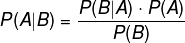
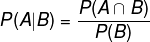
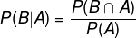
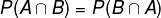
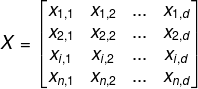
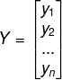
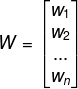

# Math Equations

Math equations and corresponding LaTex.

## Mathematical Symbols
- [Mathematical Symbols](https://en.wikipedia.org/wiki/List_of_mathematical_symbols) (_wiki page_)

## Math Equation Editor:
- [codecogs](https://www.codecogs.com/latex/eqneditor.php) (_can export as PNG_)
- [equatio](https://www.texthelp.com/en-us/products/equatio/) (_chrome plugin, integrate with google doc_)
- [sharelatex](https://www.sharelatex.com/) (_export as PDF_)


*Note*: On [codecogs](https://www.codecogs.com/latex/eqneditor.php) page, use following parameter to generate PNG images
```
png Helvetica (10pt)Normal 110 Tranparent
```

## Equations
| Id | Name | Equations | Latex |
|----|------|-----------|-------|
| 100 | Bayes Theorem |  | ```P(A|B) = \frac{P(B|A)\cdot P(A)}{P(B)}``` |
| 101 | Bayes Derivation Step 1 |  | ```P(A|B) = \frac{P(A \cap B)}{P(B)}``` |
| 102 | Bayes Derivation Step 2 |  | ```P(B|A) = \frac{P(B \cap A)}{P(A)}``` |
| 103 | Bayes Derivation Step 3 |  | ```P(A \cap B) = P(B \cap A)``` |
| 104 | Bayes Derivation Step 4 |  | ```P(A|B)\cdot P(B) = P(B|A)\cdot P(A)``` |
| 105 | Bayes Derivation Step 4 |  | ```P(A|B) = \frac{P(B|A)\cdot P(A)}{P(B)}``` |
|   |   |   |   |
| 110 | sample | | ```P(A|B) = \frac{P(B|A)\cdot P(A)}{P(B)}``` |


## Other Expression and Latex



```latex
X = \begin{bmatrix}
x_{1,1} & x_{1,2} & ... & x_{1,d}\\ 
x_{2,1} & x_{2,2} & ... & x_{2,d}\\ 
x_{i,1} & x_{i,2} & ... & x_{i,d}\\ 
x_{n,1} & x_{n,2} & ... & x_{n,d}
\end{bmatrix}
```


```latex
Y = \begin{bmatrix}
y_1\\ 
y_2\\ 
...\\
y_n
\end{bmatrix}
```


```latex
W = \begin{bmatrix}
w_1\\ 
w_2\\ 
...\\
w_n
\end{bmatrix}
```

## Old equation in google doc
- [Math formulas, write in Equatio](https://docs.google.com/document/d/1BEUXQUx4R1K1OS2o1hpHfswL3tvuF_E33FVDn6vkP10/edit?usp=sharing) (_obsolete_)

