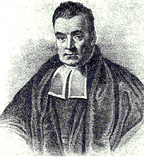
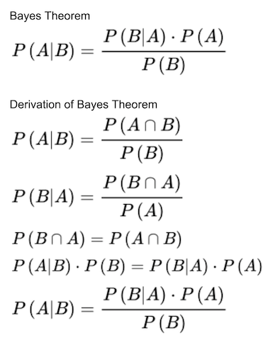

# Bayes Theorem and Naive Bayes

### Thomas Bayes(1701-1761)

### Bayes Theorem

### Concepts
- **"Naive" Bayes**: assume occurrence of features are independent of each other.
- **P(A|B)**: Conditional Probability, the probability of occurrence of event A on the condition of event B.
- **P(A|B)**: Posterior
- **P(B|A)**: Likelihood
- **P(A)**: Prior probability of proposition A
- **P(B)**: Prior probability of evidence B, marginal probability
- **P(A,B)**: Joint probability, both A and B occur, P(A,B)=P(B,A)

### Youtube Videos about Naive Bayes
- [Hacker Earth](https://youtu.be/sjUDlJfdnKM)
- [Brandon Rohrer - Bayesian Inference](https://youtu.be/5NMxiOGL39M)

### Links
[My math equations](https://docs.google.com/document/d/1BEUXQUx4R1K1OS2o1hpHfswL3tvuF_E33FVDn6vkP10/edit?usp=sharing)

