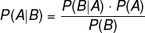

# Bayes Theorem and Naive Bayes

## Thomas Bayes(1701-1761)


## Bayes Theorem


| _Derivation_ |
|-------------|
|  |
|  |
|  |
|  |
|  |

## Concepts
- **Naive Bayes**: assume occurrence of features are independent of each other.
```P(x1,x2,...xn|C) = P(x1|C)*P(x2|C)*...*P(xn|C)```
- **P(A|B)**: Conditional Probability, the probability of occurrence of event A on the condition of event B.
- **P(A|B)**: Posterior
- **P(B|A)**: Likelihood
- **P(A)**: Prior probability of proposition A
- **P(B)**: Prior probability of evidence B, marginal probability
- **P(A&cap;B)**: or P(A,B), P(A and B), Joint probability, both A and B occur, P(A&cap;B)=P(B&cap;A)

## Youtube Videos about Naive Bayes
- [Introduction to Naive Bayes - Hacker Earth](https://youtu.be/sjUDlJfdnKM)
- [Bayesian Inference - Brandon Rohrer](https://youtu.be/5NMxiOGL39M)
- [Fun and Easy Machine Learning - Udemy](https://youtu.be/CPqOCI0ahss)

